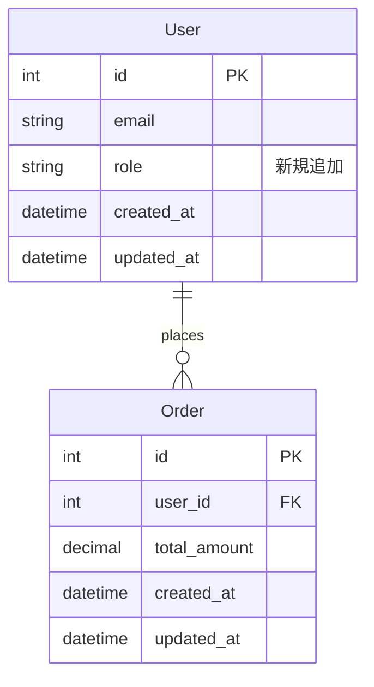
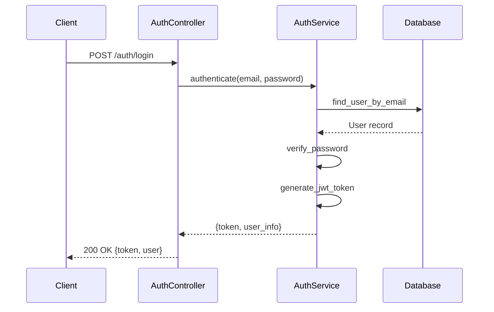
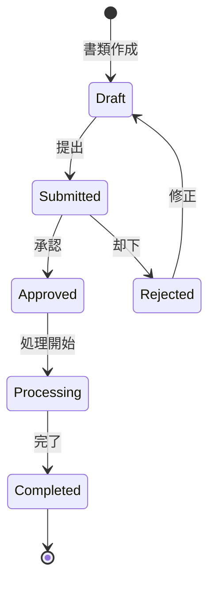
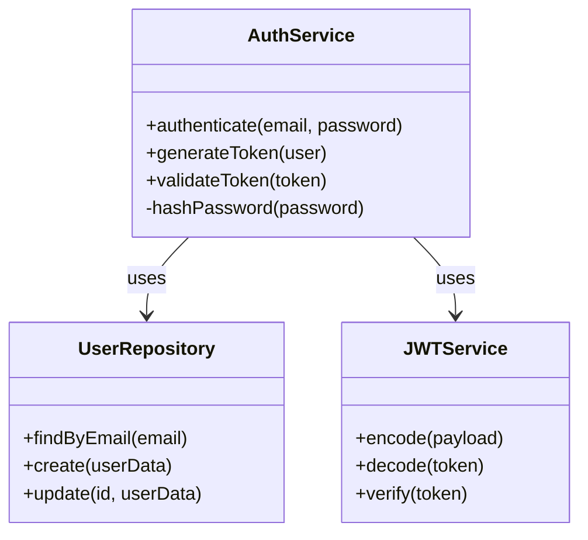

# ブランチ作成と Pull Request 提出コマンド

フィーチャーブランチの作成、コミットの整理、Pull Request の提出を自動化します。

## 前提条件
- リポジトリにコミットする予定の変更がある（ステージ済みまたは未ステージ）
- GitHub CLI (`gh`) が設定済みで認証済みであること
- リポジトリへのプッシュ権限があること
- 意図しない未追跡ファイルがないこと（意図的な変更のみが存在する状態）

## 使用方法
```bash
/create-branch-and-pr
```

## 動作
- 現在のブランチ名を記録する（ブランチ作成の親および PR のベースブランチとなる）
- 記録した親ブランチから新しいブランチを作成し、すべてのステージ済み・未ステージの変更を保持する
- 変更を分析し、適切な場合は論理的なコミットに自動分割する
- 各コミットは単一の論理的な変更または機能に焦点を当てる
- 各論理単位に対して説明的なコミットメッセージを作成する
- ブランチをリモートにプッシュする
- 適切なサマリーとテスト計画を含む Pull Request を作成する（記録した親ブランチをベースとして使用）

## 自動コミット分割のガイドライン
- 機能、コンポーネント、または関心事ごとにコミットを分割する
- 関連するファイル変更は同じコミットにまとめる
- リファクタリングと機能追加は分離する
- 各コミットが独立して理解できるようにする
- 関連性のない複数の変更は別々のコミットに分割する

## 使用例

### 例 1: 単一機能の追加
```bash
# 初期状態: 新しい認証機能を追加
$ git status
modified:   app/controllers/auth_controller.rb
new file:   app/services/auth_service.rb
modified:   spec/controllers/auth_controller_spec.rb

# コマンドを実行
/create-branch-and-pr

# 出力:
Created branch: feature/add-authentication-service
Base branch: <検出されたベース>
Created 1 commit: "feat: add authentication service with JWT support"
Pull Request created: https://github.com/user/repository/pull/123
```

### 例 2: 複数の論理的な変更
```bash
# 初期状態: リファクタリング + バグ修正 + 新機能
$ git status
modified:   frontend/src/components/Header.tsx
modified:   frontend/src/utils/validators.ts
modified:   api/app/models/user.rb
new file:   api/db/migrate/add_role_to_users.rb

# コマンドを実行
/create-branch-and-pr

# 出力:
Created branch: feature/user-roles-and-fixes
Base branch: <検出されたベース>
Created 3 commits:
  - "refactor: simplify Header component structure"
  - "fix: correct email validation regex"
  - "feat: add role-based access control to User model"
Pull Request created: https://github.com/user/repository/pull/124
```

## 技術詳細

### ブランチ命名規則
ブランチ名は変更の種類とスコープに基づいて自動生成されます:
- `feature/` - 新機能または機能強化

例:
- `feature/add-user-authentication`

### コミットメッセージ形式
Conventional Commits 仕様に従います:
```text
<type>(<scope>): <subject>

<body>

<footer>
```

タイプ:
- `feat`: 新機能
- `fix`: バグ修正
- `docs`: ドキュメント変更
- `refactor`: コードリファクタリング
- `test`: テストの追加または変更
- `chore`: メンテナンスタスク

### Pull Request の詳細
PR は以下の内容で作成されます:
- **ステータス**: ドラフト（レビューと調整のためにレディにする前に確認可能）
- **タイトル**: 変更内容の説明的なサマリー（日本語）
- **ベースブランチ**: 現在のブランチが作成された親ブランチ
- **説明**（日本語）: 以下を含む:
  - 変更のサマリー
  - ER 図やシーケンス図を Mermaid で表現（コードレビューの理解に役立つ場合）
  - コミット一覧
  - テスト計画または検証手順
  - 関連する Issue（検出された場合）

注: Pull Request のタイトルと説明はチームコミュニケーションを円滑にするために日本語で記述されます。

#### Mermaid ダイアグラムの例

**ER 図の例（データベース変更の場合）:**


**シーケンス図の例（API フローの場合）:**


**状態遷移図の例（ステータス遷移の場合）:**


**クラス図の例（サービスアーキテクチャの場合）:**


#### 内部実装
コマンドの内部処理:
```bash
# ステップ 1: 新しいブランチを作成する前に親ブランチを記録
parent_branch=$(git rev-parse --abbrev-ref HEAD)

# ステップ 2: 新しいブランチを作成してチェックアウト
git checkout -b "feature/new-feature-name"

# ステップ 3: コミットを作成...
# （コミット作成手順）

# ステップ 4: ステップ 1 で記録した親ブランチを使って PR を作成
gh pr create \
  --draft \
  --base "$parent_branch" \
  --title "機能: ユーザー認証システムの追加" \
  --body "## 概要
- JWT を使用した認証機能を実装
- ユーザーロールベースのアクセス制御を追加

## 変更内容
- 認証コントローラーの追加
- 認証サービスの実装
- テストケースの追加

## テスト計画
- [ ] ユニットテストが全て通ること
- [ ] 認証フローが正常に動作すること
- [ ] 権限チェックが適切に機能すること"
```

## 出力
- ブランチ名
- ベースブランチ名
- コミットメッセージ
- Pull Request URL
