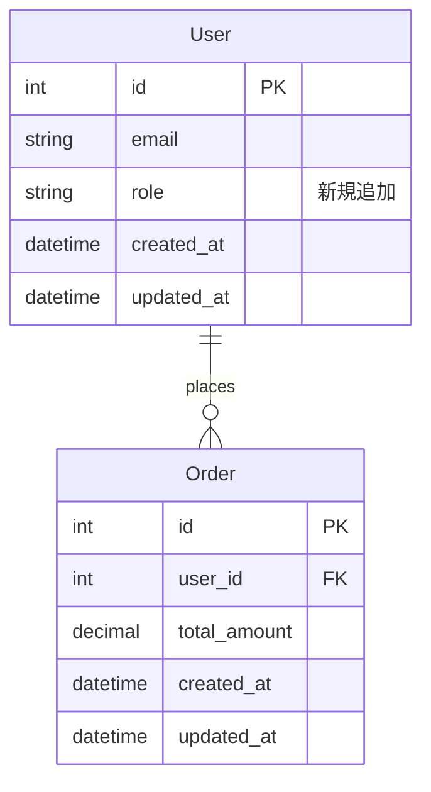
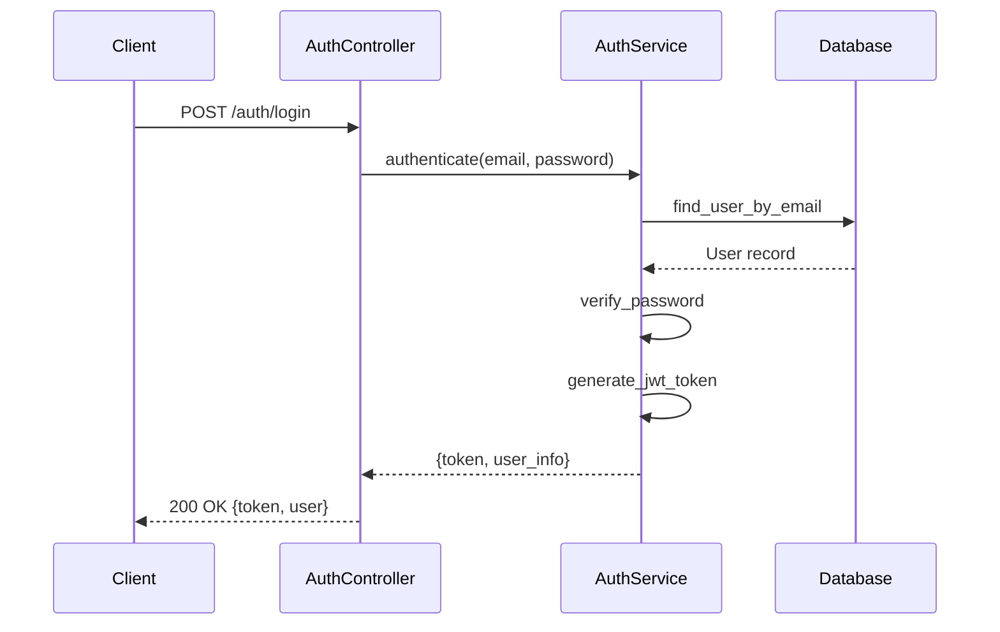
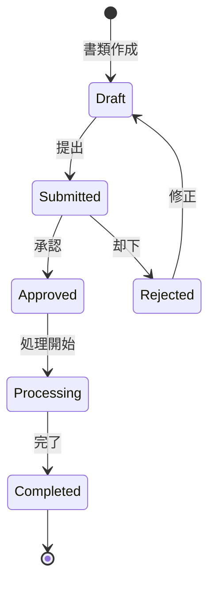
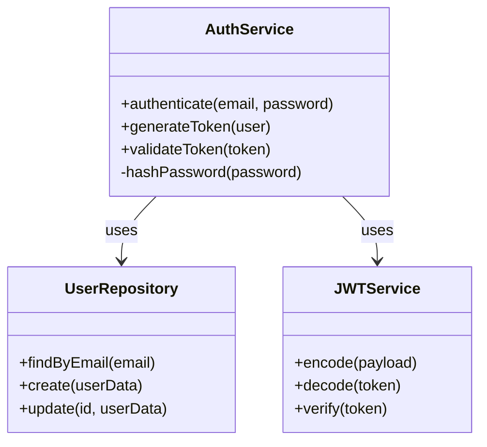

# Create a new branch and pull request command

Automates the process of creating a feature branch, organizing commits, and submitting a pull request.

## Prerequisites
- Repository has changes you intend to commit (staged or unstaged)
- GitHub CLI (`gh`) configured and authenticated
- Push access to the repository
- No unwanted untracked files; ensure only intentional changes are present

## Usage
```bash
/create-branch-and-pr
```

## Behavior
- Records the current branch name (this becomes the parent for branch creation and the base for the PR)
- Creates a new branch from the recorded parent branch, preserving all staged and unstaged changes
- Analyzes changes and automatically splits into logical commits when appropriate
- Each commit focuses on a single logical change or feature
- Creates descriptive commit messages for each logical unit
- Pushes branch to remote
- Creates pull request with proper summary and test plan, using the recorded parent branch as base

## Guidelines for Automatic Commit Splitting
- Split commits by feature, component, or concern
- Keep related file changes together in the same commit
- Separate refactoring from feature additions
- Ensure each commit can be understood independently
- Multiple unrelated changes should be split into separate commits

## Examples

### Example 1: Single feature addition
```bash
# Initial state: Added new authentication feature
$ git status
modified:   app/controllers/auth_controller.rb
new file:   app/services/auth_service.rb
modified:   spec/controllers/auth_controller_spec.rb

# Running the command
/create-branch-and-pr

# Output:
Created branch: feature/add-authentication-service
Base branch: <detected-base>
Created 1 commit: "feat: add authentication service with JWT support"
Pull Request created: https://github.com/user/repository/pull/123
```

### Example 2: Multiple logical changes
```bash
# Initial state: Refactoring + bug fix + new feature
$ git status
modified:   frontend/src/components/Header.tsx
modified:   frontend/src/utils/validators.ts
modified:   api/app/models/user.rb
new file:   api/db/migrate/add_role_to_users.rb

# Running the command
/create-branch-and-pr

# Output:
Created branch: feature/user-roles-and-fixes
Base branch: <detected-base>
Created 3 commits:
  - "refactor: simplify Header component structure"
  - "fix: correct email validation regex"
  - "feat: add role-based access control to User model"
Pull Request created: https://github.com/user/repository/pull/124
```

## Technical Details

### Branch Naming Convention
Branch names are automatically generated based on the type and scope of changes:
- `feature/` - New features or enhancements

Examples:
- `feature/add-user-authentication`

### Commit Message Format
Follows Conventional Commits specification:
```text
<type>(<scope>): <subject>

<body>

<footer>
```

Types:
- `feat`: New feature
- `fix`: Bug fix
- `docs`: Documentation changes
- `refactor`: Code refactoring
- `test`: Test additions or changes
- `chore`: Maintenance tasks

### Pull Request Details
The PR is created with:
- **Status**: Draft (to allow for review and adjustments before marking as ready)
- **Title**: Descriptive summary of changes (in Japanese)
- **Base branch**: The parent branch from which the current branch was created
- **Description** (in Japanese): Includes:
  - Summary of changes
  - Expressing ER diagrams and sequence diagrams in Mermaid (if it helps code reviewers understand)
  - List of commits
  - Test plan or validation steps
  - Related issues (if detected)

Note: Pull request titles and descriptions are written in Japanese to facilitate team communication.

#### Mermaid Diagram Examples

**ER Diagram Example (for database changes):**


**Sequence Diagram Example (for API flow):**


**State Diagram Example (for status transitions):**


**Class Diagram Example (for service architecture):**


#### Internal Implementation
The command internally uses:
```bash
# Step 1: Record parent branch BEFORE creating new branch
parent_branch=$(git rev-parse --abbrev-ref HEAD)

# Step 2: Create and checkout new branch
git checkout -b "feature/new-feature-name"

# Step 3: Make commits...
# (commit creation steps)

# Step 4: Create PR with the parent branch recorded in Step 1
gh pr create \
  --draft \
  --base "$parent_branch" \
  --title "機能: ユーザー認証システムの追加" \
  --body "## 概要
- JWT を使用した認証機能を実装
- ユーザーロールベースのアクセス制御を追加

## 変更内容
- 認証コントローラーの追加
- 認証サービスの実装
- テストケースの追加

## テスト計画
- [ ] ユニットテストが全て通ること
- [ ] 認証フローが正常に動作すること
- [ ] 権限チェックが適切に機能すること"
```

## Output
- Branch name
- Base branch name
- Commit messages
- Pull Request URL

