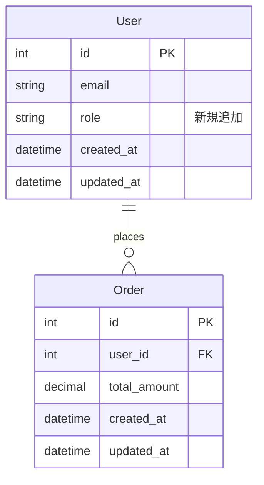
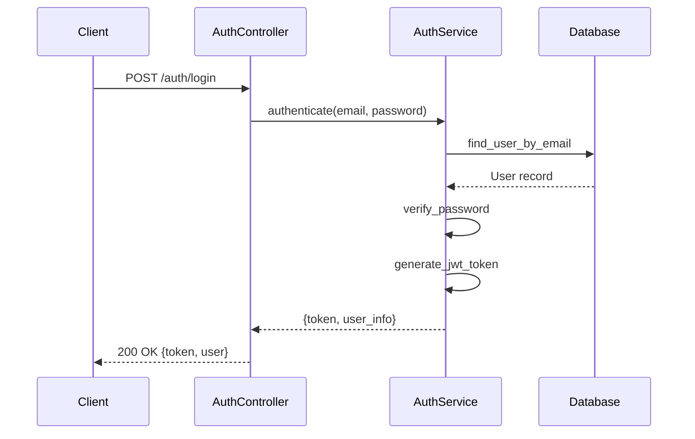
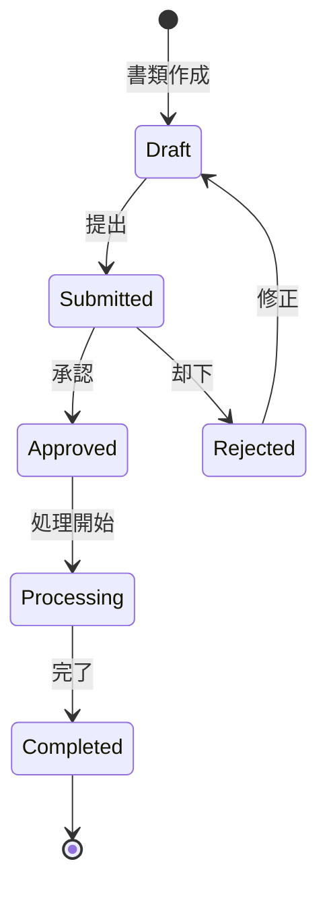
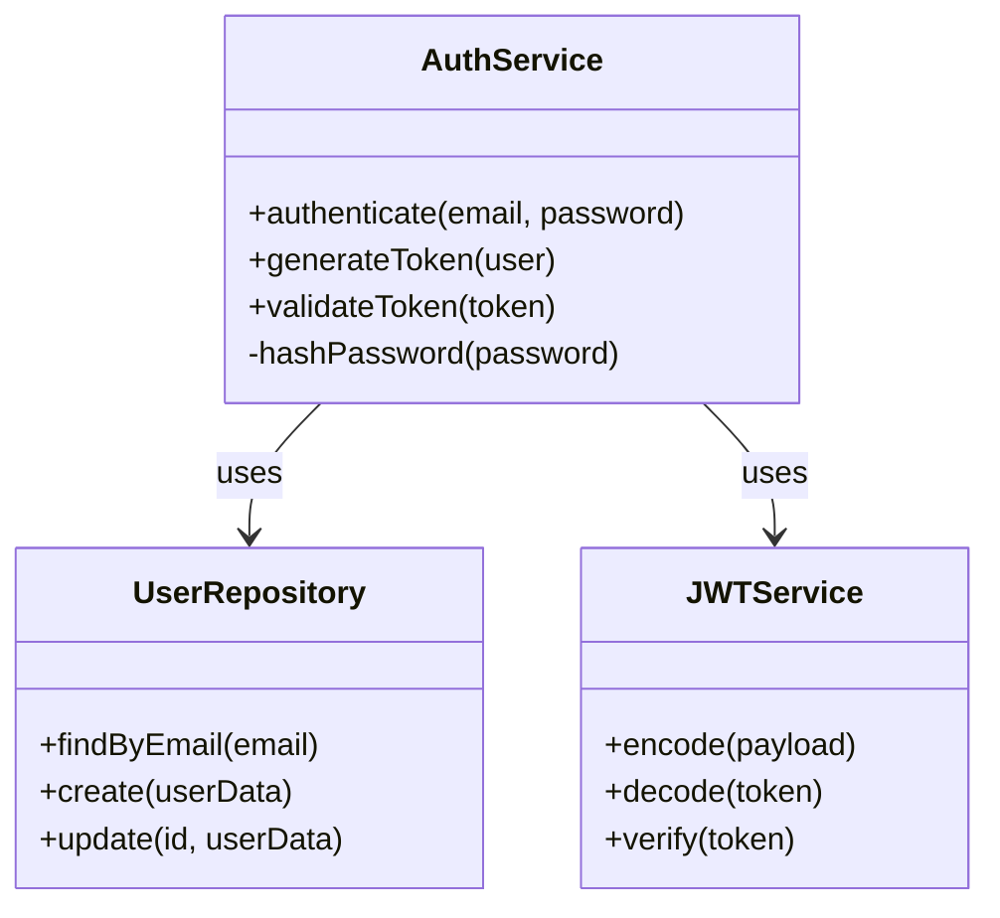

# Pull Request 作成コマンド

現在のブランチからドラフト Pull Request を作成します。

## 前提条件
- GitHub CLI (`gh`) が設定済みで認証済みであること
- リポジトリへのプッシュ権限があること
- コミット済みの変更があること

## 動作
1. ベースブランチを特定する
2. ブランチをリモートにプッシュする
3. 適切なサマリーとテスト計画を含む Pull Request を作成する

## ベースブランチの特定
以下の優先順位でベースブランチを決定する:
1. ユーザーから指定された場合はそれを使用する
2. 現在のブランチの分岐元を検出する
3. リポジトリのデフォルトブランチ（main または master）を使用する

## Pull Request の詳細
PR は以下の内容で作成されます:
- **ステータス**: ドラフト（レビューと調整のためにレディにする前に確認可能）
- **タイトル**: 変更内容の説明的なサマリー（日本語）
- **ベースブランチ**: 検出された親ブランチ
- **説明**（日本語）: 以下を含む:
  - 変更のサマリー
  - ER 図やシーケンス図を Mermaid で表現（コードレビューの理解に役立つ場合）
  - コミット一覧
  - テスト計画または検証手順
  - 関連する Issue（検出された場合）

注: Pull Request のタイトルと説明はチームコミュニケーションを円滑にするために日本語で記述されます。

### Mermaid ダイアグラムのガイドライン
コードレビューの理解に役立つ場合、以下のような図を含める:

**ER 図**: データベーススキーマの変更がある場合

**シーケンス図**: API フローや処理の流れを説明する場合

**状態遷移図**: ステータスの遷移ロジックがある場合

**クラス図**: サービスアーキテクチャの変更がある場合

## 出力
- Pull Request URL
